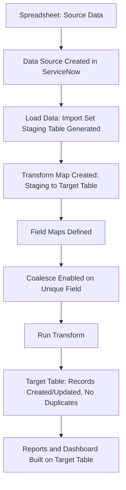

# Phase 3: Project Design Phase

**Team ID:** SWTID-2026-2183  
**Project Title:** Import Data Using Transform Maps (Spreadsheet)  
**Phase:** Phase 3 - Project Design Phase  
**Team Members:** Ashika V (Team Leader & GitHub Repository Owner), Bhavana B A, Athira B S, Nishma W

## Workflow Architecture
1. **Data Source Creation:** An administrator creates a new Data Source in ServiceNow and uploads the source spreadsheet (Excel/CSV).
2. **Load Data:** The "Load Data" action is run against the Data Source, which automatically generates a new Import Set (staging) table containing one row per spreadsheet row and one column per spreadsheet column.
3. **Transform Map Creation:** A Transform Map is created, linking the Import Set (staging) table as the source table to the desired ServiceNow target table.
4. **Field Mapping:** Field maps are defined on the Transform Map, mapping each relevant staging column to its corresponding target table field.
5. **Coalesce Configuration:** A unique field map (e.g. ID/Email/Asset Tag) is marked as "Coalesce," so the transform updates an existing record instead of creating a duplicate when a matching value is found.
6. **Run Transform:** The Transform Map is executed against the loaded import set, converting staged rows into records in the target table.
7. **Validation:** The target table is checked to confirm records were created/updated correctly and that no duplicates exist.
8. **Reporting:** Reports and a dashboard are built on the target table to present the imported data.

## System Flowchart

